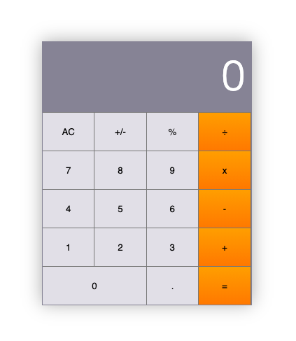

# Math Magicians

> React based SPA.  

# Demo Link

Click [here](https://mmatongo.github.io/math-magicians) to view the website online.

# Screenshot

# Getting Started

To get a local copy up and running follow these simple steps.

- You can clone this repo by typing `git clone git@github.com:mmatongo/math-magicians.git` on your terminal.

- Type `cd math-magicians` to access the project on the terminal.
  
- Run `npm install` from your editor's terminal.

- Run `npm run build` from your editor's terminal.

- Run `npm run start` from your editor's terminal to view the project in your browser.

- Run `npx hint` . to check for HTML Linter errors.

- Run `npx stylelint "**/*.{css,scss}"` to check for CSS Linter errors.

# This project was built with:

HTML5

CSS3

React

# Version Control System

GIT

# 👤 Authors

👤 **Daniel M. Matongo**

- GitHub: [Daniel M. Matongo](https://github.com/mmatongo)
- LinkedIn: [Daniel M. Matongo](https://linkedin.com/in/mmatongo)

# 🤝 Contributing

Contributions, issues, and feature requests are welcome!

Feel free to check the [issues page](https://github.com/mmatongo/math-magicians/issues).

# Show your support

Give a ⭐️ if you like this project!

# Acknowledgement
- Hat tip to anyone whose code was a source of inspiration.
- A big thanks to [@microverseinc](https://github.com/microverseinc) for providing the involvement API.

# 📝 License

This project is [MIT](./MIT.md) licensed.
